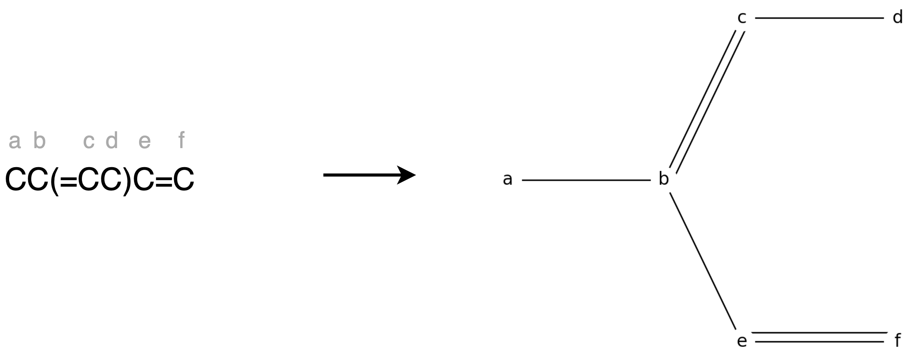
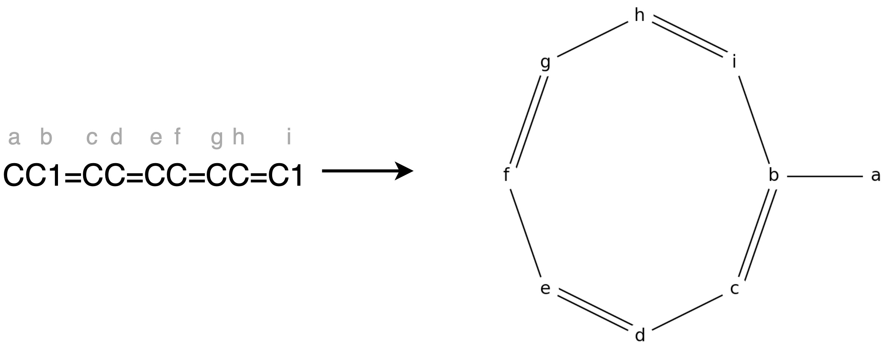
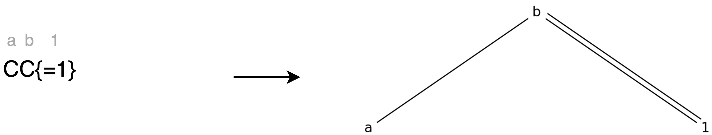
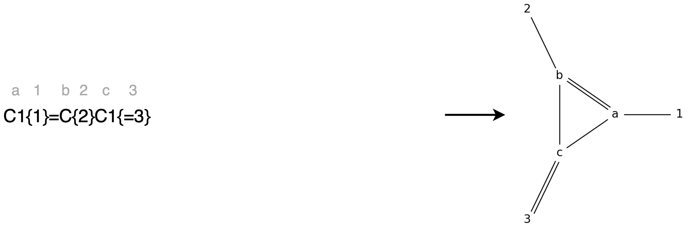
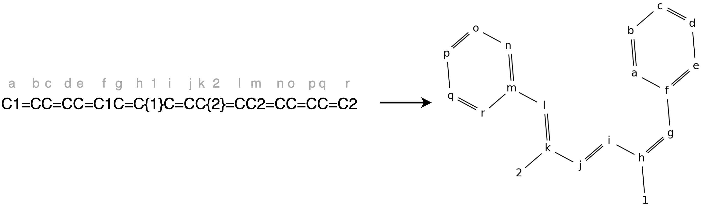

# soliton-implementation
**Author: Helena Schulz**

This repository contains an implementation of the soliton model.
It provides the Mini Soliton Automata Software which can be used to compute all soliton paths between two exterior nodes of a soliton graph.

The software's graphical interface gives the user the possibility to specify a soliton graph and a pair of exterior nodes.
It also shows visualisations of this graph and the found soliton paths.

## Getting started
First, make sure that the latest version of pip is installed on your computer/ virtual environment.

You can download the package containing the software via terminal by using the command
```shell
pip install git+https://github.com/schulz-helena/soliton-implementation
```

## Usage
To start the software use
```shell
mini-soliton-automata-software
```
First specify a molecule by using the input syntax described below.
The molecule will then get converted into a soliton graph.
In the graph interior nodes are marked as letters and exterior nodes are marked as numbers.
Next choose a pair of exterior nodes.
The soliton will enter the soliton graph at the first exterior node and leave it at the second exterior node.
All possible soliton paths between these nodes will be computed and made available to choose from.
Now you can look at the soliton graph's adjacency matrices for every timestep of traversal of the soliton path, the end result and an animation of the soliton traversing the selected path.

## Input syntax
The syntax of the input is based on the Simplified Molecular Input Line Entry Specification (SMILES) that is used to represent molecules as strings.
This SMILES representation is extended by a rule concerning the specification of exterior nodes.

- Carbon atoms are marked with `C`.
- Single bonds are marked with `-` or no character at all.
- Double bonds are marked with `=`.


- Branches are embedded in round brackets.


- The two connecting atoms of a ring are marked with the same number (e.g. `C1` and `C1`).
These atoms are connected by a single bond.


- Exterior nodes are marked with a bond and a number embedded in braces.


Bonds of atoms inside parenthesis always have to be put inside of them, not in front (e.g. `C(=C)` instead of `C=(C)`)!

### Examples of soliton graphs



