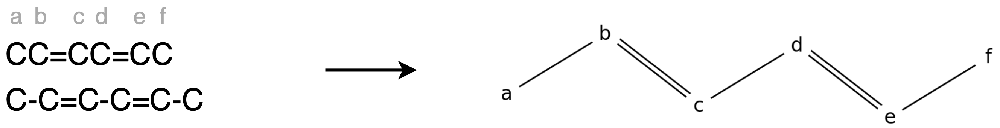

# soliton-implementation
**Author: Helena Schulz**

This repository contains an implementation of the soliton automata model.
It provides the Soliton Automata Software which can be used to compute all soliton paths/ all total legal configurationtrails in a soliton graph.

The software's graphical interface gives the user the possibility to specify a soliton graph, a set of bursts (in multiwave case) and a stop number to create a soliton automata.
It also shows visualisations of this graph and the found soliton paths/ total legal configurationtrails.

## Getting started
First, make sure that the latest version of pip is installed on your computer/ virtual environment.

You can download the package containing the software via terminal by using the command
```shell
pip install git+https://github.com/schulz-helena/soliton-implementation
```

## Usage
To start the software use
```shell
solitons
```
There a seperate modes for single and multiwave soliton automata.
In both modes first specify a molecule by using the input syntax described below and a stop number.
The stop number determines after how many identical soliton graphs with the same soliton positions it will stop searching for a soliton path on the current path.
The molecule will then get converted into a soliton graph.
In the graph interior nodes are marked as letters and exterior nodes are marked as numbers.

In multiwave case specify a set of bursts for the creation of the multiwave soliton automata now.
Next choose a pair of exterior nodes/ a burst or let the software compute paths between all pairs of exterior nodes/ for all bursts of the set.
All possible soliton paths/ total legal configurationtrails will be computed and made available to choose from.
Now you can look at the soliton graph's adjacency matrices for every timestep of traversal of the soliton path, the end result and an animation of the soliton(s) traversing the selected path(s).
Cases, in which solitons loop through a certain path multiple times but don't leave the soliton graph will also be displayed.

## Input syntax
The syntax of the input is based on the Simplified Molecular Input Line Entry Specification (SMILES) that is used to represent molecules as strings.
This SMILES representation is extended by a rule concerning the specification of exterior nodes.

- Carbon atoms are marked with `C`.
- Single bonds are marked with `-` or no character at all.
- Double bonds are marked with `=`.


- Branches are embedded in round brackets.


- The two connecting atoms of a ring are marked with the same number (e.g. `C1` and `C1`).
These atoms are connected by a single bond.


- Exterior nodes are marked with a bond and a number embedded in braces.


Bonds of atoms inside parenthesis always have to be put inside of them, not in front (e.g. `C(=C)` instead of `C=(C)`)!

### Examples of soliton graphs
C1({1})=C({2})C1({=3})


C1=CC=CC=C1C=C({1})C=CC({2})=CC2=CC=CC=C2


